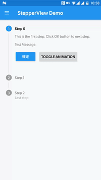

# MaterialStepperView

[](https://jitpack.io/#moe.feng/MaterialStepperView)

[Material Design Stepper](https://material.io/guidelines/components/steppers.html) Widgets on Android (SDK 17+)


## Import (Gradle)

First, add it in your root build.gradle at the end of repositories:

```gradle
allprojects {
	repositories {
		...
		maven { url 'https://jitpack.io' }
	}
}
```

Add the dependency to your app modules:

```gradle
dependencies {
    compile 'moe.feng:MaterialStepperView:latest-version'
}
```

## Styles

Currently, we have only made Vertical style stepper view.

There will be more styles in the future.

You can customize normal/activated point color, done icon, animation duration and animation enabled also. [How to?](https://github.com/fython/MaterialStepperView/wiki/Set-item-values-and-styles)

### Vertical Stepper View

[](https://www.youtube.com/watch?v=y9gSwHKwxVM)

[Read Wiki](https://github.com/fython/MaterialStepperView/wiki/Vertical-Style) and learn how to use

## Support me

If you like this library project and you are willing to support me, you can donate me via Alipay or PayPal.

Alipay: fythonx@gmail.com

PayPal: [https://www.paypal.me/fython](https://www.paypal.me/fython)


